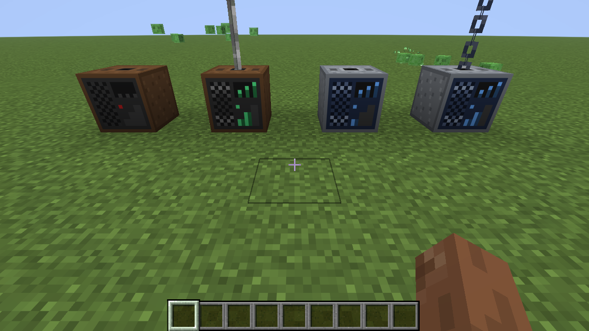
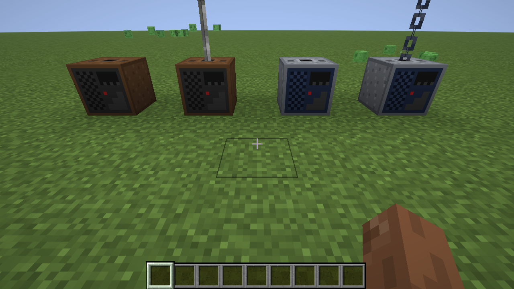
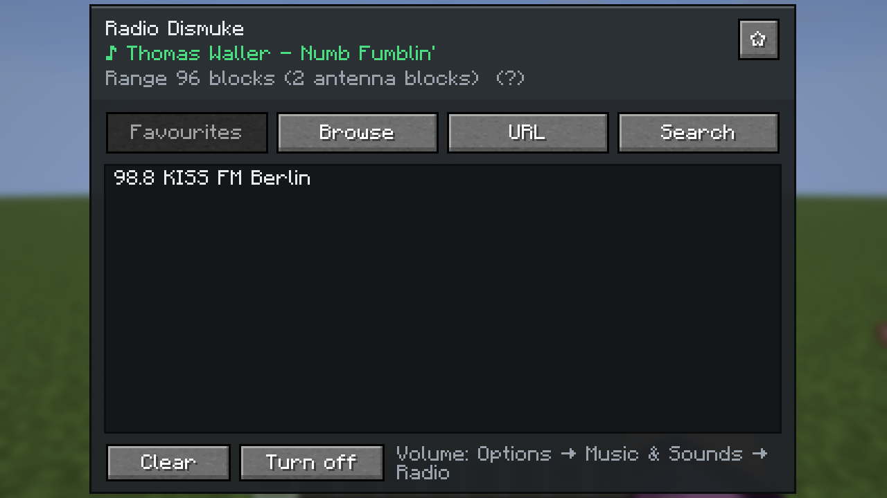
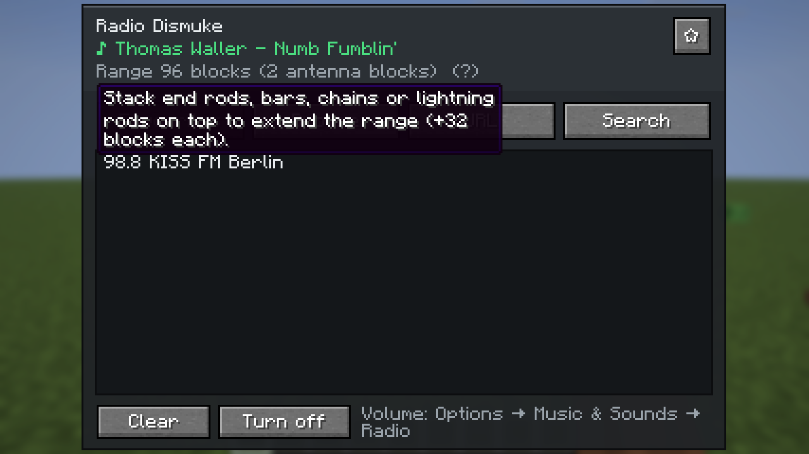
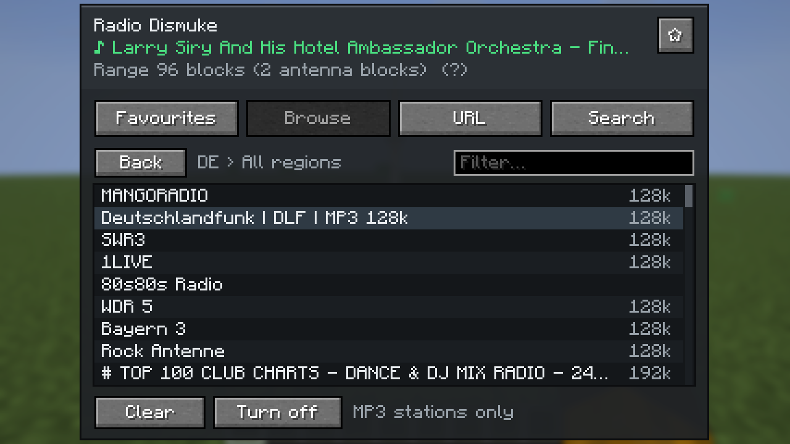
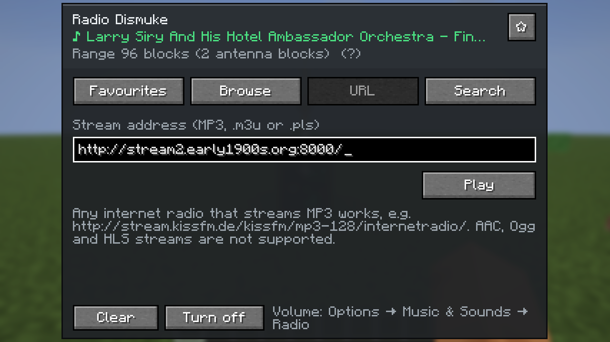
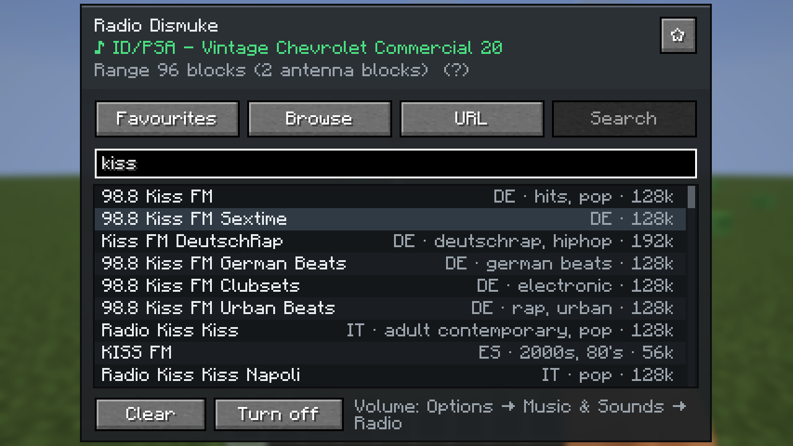
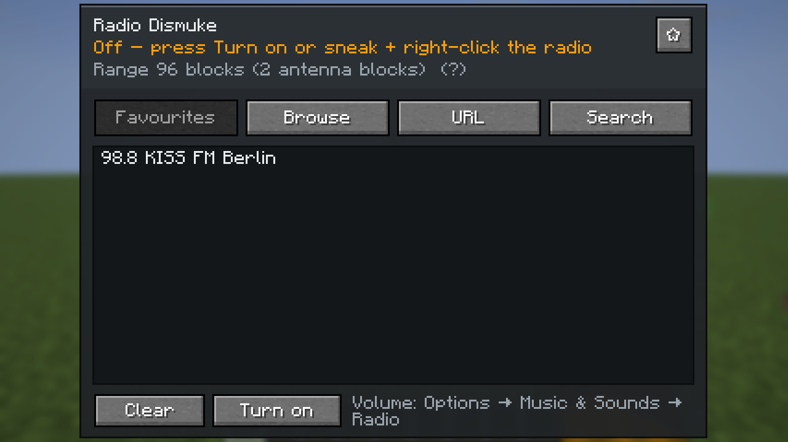
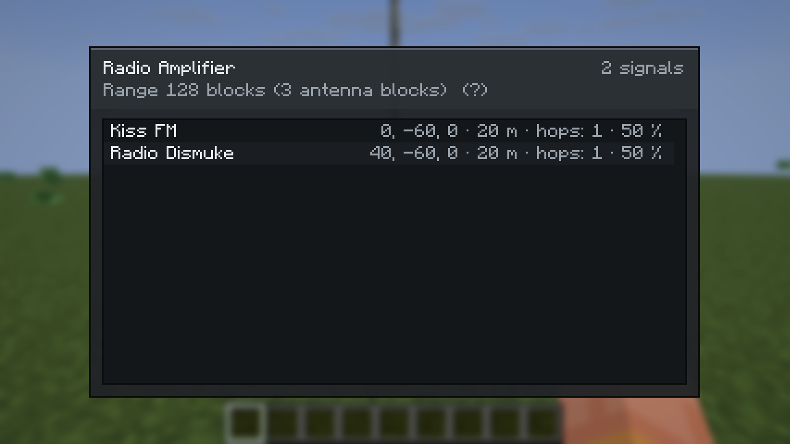
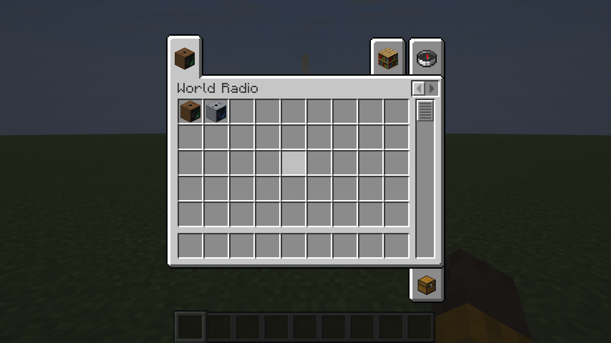

# World Radio


Internet radio for Minecraft 26.3 (Fabric). A **Radio** block plays an MP3 internet stream to everyone near it,
**Radio Amplifiers** carry the signal further. Pick stations from the free [Radio-Browser](https://www.radio-browser.info)
catalogue, search them by name or genre, paste any stream address, and keep your own list of favorites that comes
with you into every world. Both blocks are in their own creative tab, *World Radio*; the items show them switched on.



## Download

Get `worldradio-<version>.jar` from [Modrinth](https://modrinth.com/mod/world-radio), [CurseForge](https://www.curseforge.com/projects/1711984) or the
[GitHub releases](../../releases) and put it into `mods/` on the client and the server, next to Fabric API.
Requires Minecraft 26.3, Fabric Loader 0.19.5+ and Java 25 (for Minecraft 26.2 use version 1.0.1, branch `26.2`). The server never streams anything: it only stores
which station a radio plays, every player's game fetches the stream itself.

## Usage

| Action | Radio | Amplifier |
|---|---|---|
| Right-click (with or without an item) | opens the station screen | lists the signals it receives |
| Sneak + right-click (empty main hand) | switches it on or off, the station stays | – |
| Antenna blocks stacked on top | +32 blocks of range each | same |

The switch works with an empty main hand (the offhand may hold anything); with an item in the main hand, sneaking
places or uses that item as usual. The station screen has a *Turn off* / *Turn on* button as well. An antenna block clicked onto the top face (the
socket) is placed there; to place anything else against a radio or amplifier, sneak. `E` (the inventory key) closes
the screens, unless you are typing into a text box.

- **Range**: 32 blocks, plus 32 for every antenna block stacked straight on top, up to 32 antenna blocks (1056
  blocks). The column counts from the block above the radio up to the first block that is not an antenna block;
  materials may be mixed and the way a block faces does not matter. The screens show the range, e.g. "Range 128
  blocks (3 antenna blocks)"; the counter updates within a second of a change anywhere in the column.
- **Antenna blocks**: end rods, iron bars, iron chains, lightning rods, copper bars and copper chains, every oxidation
  stage and the waxed ones too (27 blocks). They are the block tag `worldradio:antenna`, so data packs can add more.
- **The front shows the state**: no station, switched off (radio) or no signal (amplifier) = still, red light;
  otherwise rings run out of the speaker, the meter moves and one bar lights up for the base range, two for one to
  three antenna blocks, three for four or more. Before and after tuning the radio in the picture above:

  
- **Volume** falls from 100 % at the block to 20 % at the edge of the range, then fades out at the same pace over
  another quarter of the range (at least 10 blocks): a radio with 288 blocks of range is heard up to 360 blocks.
  Each radio has its own volume slider in its screen (for everyone who hears it, amplifiers included); each
  player's own slider is in *Options → Music & Sounds → Radio*.
- **Far away**: radios and amplifiers keep sending when nobody is near them and their chunks are not loaded; the
  server remembers every one of them (also across restarts) and tells the players what can be heard, so a station
  does not stop at the edge of the view distance.
- **Direction**: 70 % of the sound plays evenly in both ears, 30 % comes from the side the radio is on (left or
  right; ahead and behind sound the same). The share can be changed in the config.
- **Amplifiers** re-send every radio signal that reaches them (from a radio or from another amplifier, any number of
  hops) with their own range. One signal plays at full volume, two or more share the amplifier at 50 % each.
- If the same station can be heard from several places (a radio and an amplifier), only the loudest one plays, so
  nothing echoes. Up to six different stations play at once.
- Anyone may use any radio. Each player's game streams the audio itself, so players hear it a few seconds apart.

### Station screen

The screen looks like an old teak radio: the station on a black glass dial, speaker cloth behind the lists, white
piano keys.



- **Favorites** – your own list, kept on your computer (`config/worldradio-favorites.json`), the same in every
  world and on every server. The star next to the station name adds or removes the current station; the pencil
  at the end of a row (it shows while the mouse is on the row) renames it: Enter keeps the new name, Esc drops it.
  Worlds from before 0.5 had one list for everyone; its stations are taken over once when you join such a world.
- **Browse** – country → region → station, with a filter box. Only MP3 stations are listed.
- **URL** – any `http(s)` MP3 stream, or an `.m3u` / `.pls` playlist that points to one.
- **Search** – type a station name or a genre (`jazz`, `oldies`, `80s`); the search starts when you stop typing.
  Name matches come first, then genre matches; within each, stations from your own country (your Windows region,
  else the game language) lead, then the most listened to. Each row shows country, the first two genres and the
  bitrate.
- **Clear** removes the station, **Turn off** / **Turn on** silences the radio and keeps it, **Volume** sets this
  radio's volume for everyone who hears it. The line under the name shows the stream state and the current song
  title when the station sends one (or "Off"); the line below it shows the range. Hovering the range line (or the amplifier's) explains the antenna blocks:



| Browse | URL | Search |
|---|---|---|
|  |  |  |

| Switched off | Amplifier | Creative tab |
|---|---|---|
|  |  |  |

### Limits

- MP3 only: AAC, Ogg/Opus and HLS streams show "Cannot play this stream". About 70 % of the Radio-Browser
  catalogue is MP3.
- Stereo streams are mixed down to mono before the mod's own left/right panning.
- Some stations only allow known player apps and refuse the connection (SomaFM, for example).
- Version 0.3.0 replaced the signal strength (`power=0..2`) with antennas. Radios and amplifiers from an older world
  keep their station and simply work with 32 blocks plus their antenna column; the old strength is ignored. Radios
  from 0.3 load switched on.

## Crafting

Both recipes are in the Redstone tab of the recipe book once you carry a copper ingot.

Radio – a wooden case with a speaker and a tuning circuit:

```
P I P      P = any planks, I = iron ingot
C N R      C = copper ingot (the coil), N = note block (the speaker), R = redstone (the tuner)
P P P
```

Radio Amplifier – a radio in a steel case that re-sends:

```
I C I      I = iron ingot, C = copper ingot
C W C      W = a radio
I R I      R = redstone
```

## Config

`config/worldradio.json`:

```json
{
  "configVersion": 4,
  "baseRange": 32,
  "antennaStep": 32,
  "maxAntenna": 32,
  "maxStations": 6,
  "directionalShare": 0.3
}
```

`baseRange`, `antennaStep` and `maxAntenna` are read by the server (radios and amplifiers send their range to the
players); a `ranges` list from 0.1/0.2 is ignored and dropped from the file, and a 0.3 file (no `configVersion`)
with the old default step of 8 is moved to 32. `maxStations` (at most 8, which is what the sound engine allows) and
`directionalShare` (0 = all at the player, 1 = fully left/right) are read by each player's game. The "+32 blocks
each" in the range tooltip comes from the player's own file.

## Commands (operators)

- `/worldradio tune <pos> "<url>" [name]` – tune a radio.
- `/worldradio enable <pos> true|false` – switch a radio on or off.
- `/worldradio status <pos>` – range, antenna blocks and level of a radio or amplifier, whether the radio is on and
  what it plays, or which signals the amplifier receives.
- `/worldradio volume <pos> <0-100>` – set a radio's volume.

## Building

Java 25, `./gradlew build` → `build/libs/worldradio-<version>.jar`. Needs Fabric API on client and server.

Test tools in `tools/`: `test-signal.sh` (signal graph, antenna range and level, volume curve, source choice,
panning – plain Java), `stream-probe.sh` (decodes live streams outside Minecraft; `--pan -1|0|1` measures the stereo
mix), `dev-test-network.sh` (RCON test against the dev server), `dev-screenshot.sh`
(dev client screenshots, clicks with an item in hand, the on/off button, list clicks, renaming, the volume slider,
typing, hovering, walking and circling, and a per-second log of what the player hears).

The art is generated, run from the project folder: `java tools/MakeTextures.java` (block textures and models),
`java tools/MakeGuiTextures.java` (screen panels and keys), `java tools/MakeLogo.java <variant>` (the logo
`icon.png`, rendered from the block textures; previews in `art/logo/`).

## Credits

- MP3 decoding: [JLayer](https://github.com/umjammer/jlayer) 1.0.1 by JavaZOOM (LGPL 2.1), bundled unmodified.
- Station catalogue: [Radio-Browser](https://www.radio-browser.info) community database.

## Licence

MIT, see [LICENSE](LICENSE). By BaconCakeFactory.
