# World Radio

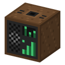

Internet radio for Minecraft 26.2 (Fabric) that works like real radio. A **Radio Transmitter** sends an MP3 internet
stream as a signal, **Radio Channels** next to it add more stations to the same antenna, **Radio Amplifiers** carry
the signals further, and you listen where a signal arrives: with a **Radio** block that plays to everyone around it
(further with **Speakers**), or with a **Portable Radio** in your inventory that only you hear (put it down and
everyone around hears it). Where several signals
arrive, every radio picks its own station. Pick the transmitter's station from the free
[Radio-Browser](https://www.radio-browser.info) catalogue, search by name or genre, paste any stream address, and keep
your own list of favorites that comes with you into every world. Everything is in its own creative tab, *World Radio*.

> **Coming from 1.x?** The old Radio block is now the Radio Transmitter: it keeps its station, antenna and range, but
> it no longer makes a sound by itself. Place a Radio near your builds or carry a Portable Radio to hear it again.

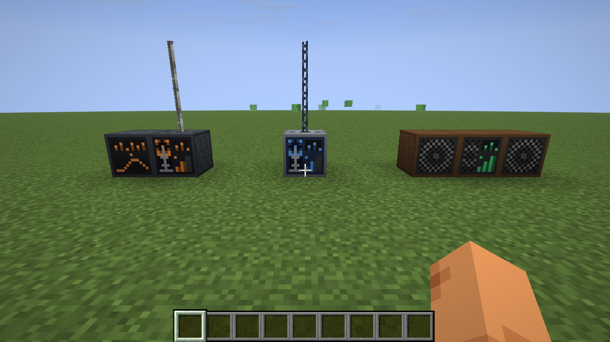

## Download

Get `worldradio-<version>.jar` from [Modrinth](https://modrinth.com/mod/world-radio), [CurseForge](https://www.curseforge.com/projects/1711984) or the
[GitHub releases](../../releases) and put it into `mods/` on the client and the server, next to Fabric API.
Requires Minecraft 26.2, Fabric Loader 0.19.3+ and Java 25. The server never streams anything: it only stores
which station a transmitter sends and what each radio is set to, every player's game fetches the stream itself.

## Guide book

Every player gets a **World Radio Guide** the first time they join: a book with a chapter for every block and for
range and antennas, finding stations and listening, with the recipes and build pictures, in English and German.
Right-click opens it. Lost it? Craft a new one from a book and a copper ingot, or take it from the creative tab.

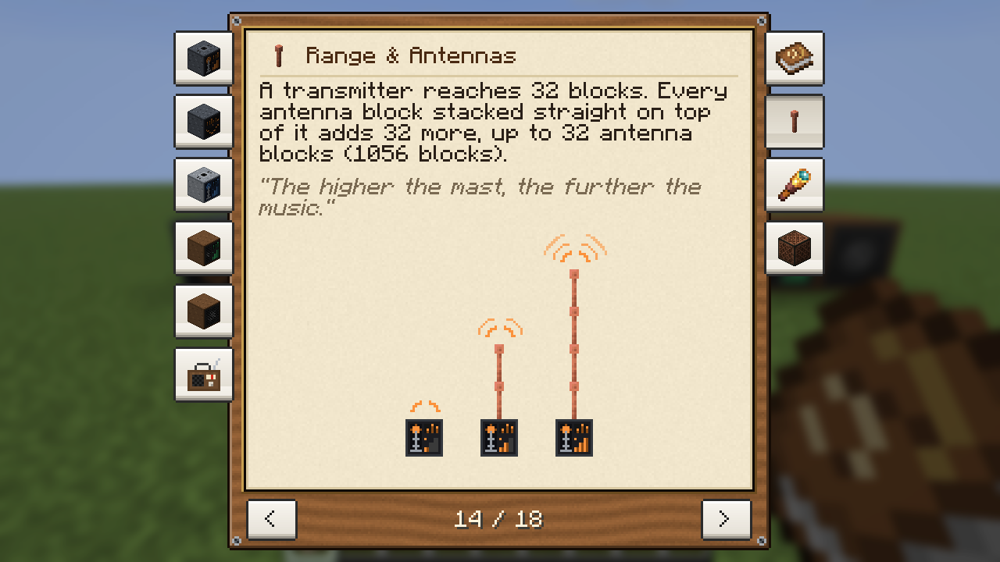

## Usage

| Action | Radio Transmitter | Radio Channel | Radio Amplifier | Radio | Portable Radio |
|---|---|---|---|---|---|
| Right-click | opens the station screen | opens the station screen | lists the signals it receives | opens the tuner | opens the tuner |
| Sneak + right-click | switches it on or off, the station stays | same | – | switches it on or off | into the air: switches it on or off; on a block: puts it down |
| Antenna blocks stacked on top | +32 blocks of signal range each | – (uses its transmitter's) | +32 each | – | – |
| Makes sound | no | no | no | for everyone in its hearing range | for you, anywhere in your inventory; put down: like a Radio |

The **Speaker** has no screen: placed against a Radio (or against a speaker that is already connected) it makes that
radio heard 4 blocks further. A Portable Radio that is put down has to stand on top of the speaker.

The switch on the blocks works with an empty main hand (the offhand may hold anything); with an item in the main
hand, sneaking places or uses that item as usual. The screens have a *Turn off* / *Turn on* button as well. An antenna
block clicked onto the top face (the socket) is placed there; to place anything else against one of the blocks,
sneak. `E` (the inventory key) closes the screens, unless you are typing into a text box.

- **Signal range** of a transmitter or amplifier: 32 blocks, plus 32 for every antenna block stacked straight on top,
  up to 32 antenna blocks (1056 blocks). The column counts from the block above up to the first block that is not an
  antenna block; materials may be mixed and the way a block faces does not matter. The screens show the range, e.g.
  "Range 128 blocks (3 antenna blocks)"; the counter updates within a second of a change anywhere in the column.
- **Antenna blocks**: end rods, iron bars, iron chains, lightning rods, copper bars and copper chains, every oxidation
  stage and the waxed ones too (27 blocks). They are the block tag `worldradio:antenna`, so data packs can add more.
- **Radio Channels** send more than one station from one transmitter: tune a channel like a transmitter and put it
  against one (any side, also below), or against a channel that is already connected: chains work. The transmitter
  then sends the channel's station too, from its own place and with its own antenna and range, up to 64 stations.
  A channel that is connected to no transmitter sends nothing; a switched-off transmitter
  switches its channels off with it, and a transmitter without a station of its own still sends its channels'.
- **Amplifiers** pass on every signal that reaches them (from a transmitter or from another amplifier, any number of
  hops) with their own range.
- **Radio** (block): its tuner lists the stations whose signal reaches the block; click one to play it. It has its own
  volume. Its **hearing range** is 4 blocks, plus 4 for every **Speaker** connected to it, up to 64: speakers that
  touch the radio count, and so do speakers that touch one of those, and so on in a chain. The sound falls from
  100 % at the block to 20 % at the hearing range and fades out over the next quarter of the range (at least 2
  blocks). It is heard by everyone in that range and comes from the radio's direction, also with speakers. If its
  station's signal goes away, it falls silent and plays again when the signal is back.
- **Portable Radio** (item): its tuner lists the stations that arrive where you stand. It plays while it is anywhere
  in your inventory, only for you, at full volume inside the signal range; past the range it fades out over the next
  10 blocks (a quarter of the range above 40). The first portable radio in the inventory that is switched on and
  tuned plays. The item's tooltip shows its station, and the item itself shows whether it is on (green lights and the
  antenna pulled out when it is switched on and tuned). Sneak + right-click on a block **puts it down**: there it is a
  small radio with the tuner and the hearing range of the Radio block (4 blocks). Speakers add to it only when it
  stands on top of one; more speakers can be chained to that one. A bare hand breaks it at once to take it along again; station, volume and on/off travel with it
  both ways.
- **The front shows the state**: no station, switched off or no signal = still, red light; otherwise the transmitter's
  mast sends waves (the radio's speaker: rings), the meter moves and the bars light up (transmitter and amplifier:
  one bar for the base range, two for one to three antenna blocks, three for four or more). A channel has a wide
  meter, the light and a scope with a running wave; a speaker's ring runs outwards while its radio plays.
- **Far away**: transmitters and amplifiers keep sending when nobody is near them and their chunks are not loaded;
  the server remembers every one of them (also across restarts), so a signal does not stop at the edge of the view
  distance.
- **Direction**: a Radio block's sound comes from the block, like any sound in the world, and follows at once when
  you turn. A Portable Radio you carry plays in both ears alike.
- If the same station can be heard from several places (two radios, or a radio and your portable radio), only the
  loudest one plays, so nothing echoes. Up to six different stations play at once.
- Each player's own volume slider is in *Options → Music & Sounds → Radio*.
- Anyone may use any block. Each player's game streams the audio itself, so players hear it a few seconds apart.

### Tuner (Radio and Portable Radio)

| Radio | Portable Radio |
|---|---|
| 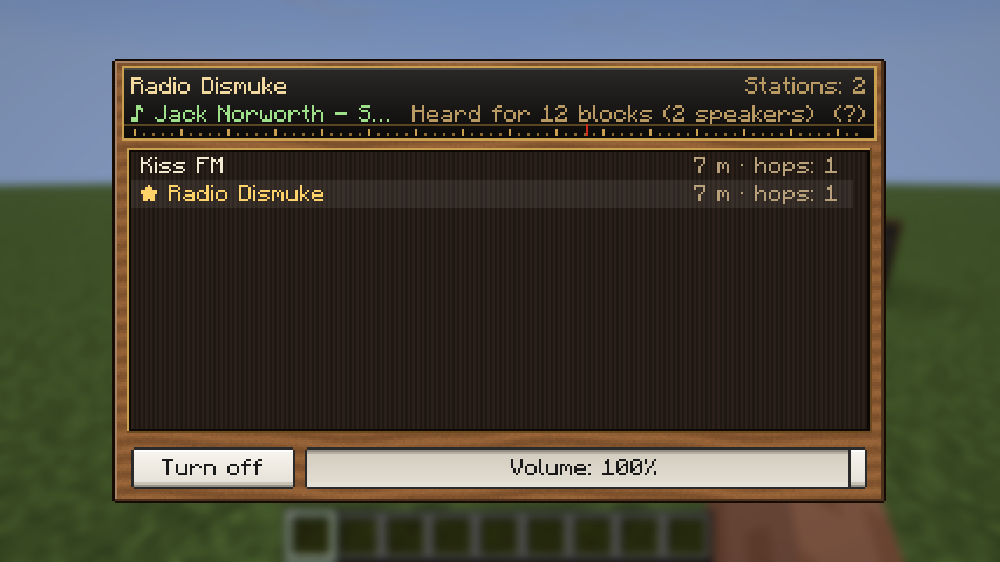 | 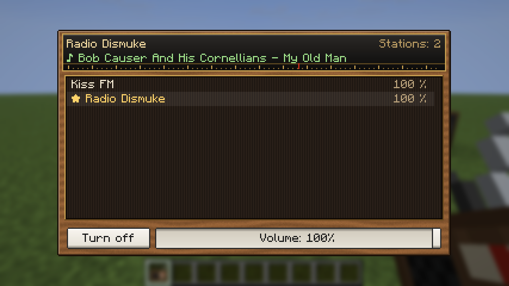 |

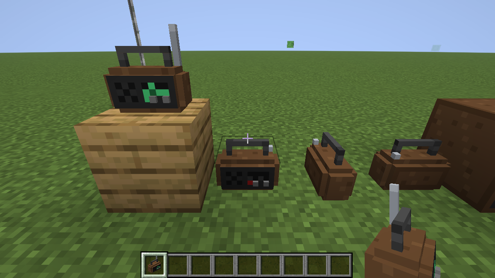

Click a station to play it; the key under the list switches the radio on or off, the slider is its volume.

### Station screen (Radio Transmitter and Radio Channel)

All screens share one design, an old radio with the station on a glass dial, cloth behind the lists and white piano
keys, in the colours of their block: dark steel and orange for the transmitter and the channel, light steel and blue
for the amplifier, teak for the radios.

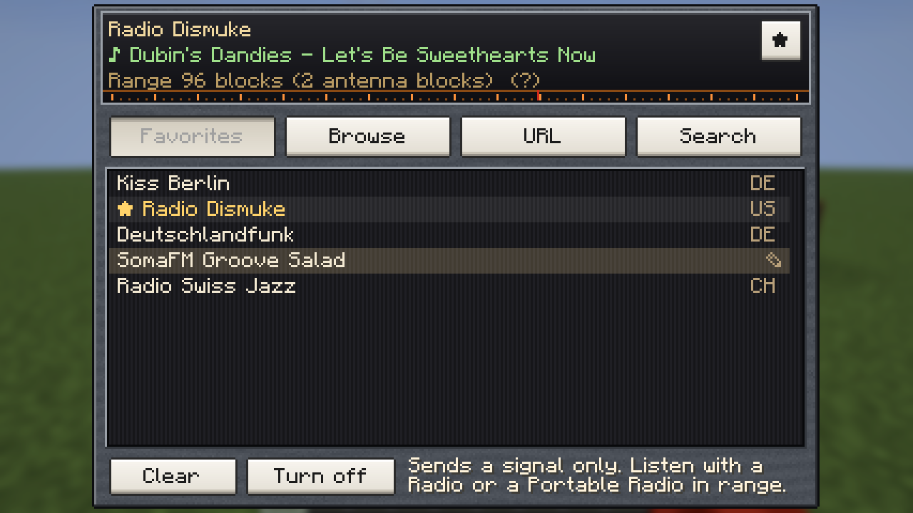

- **Favorites** – your own list, kept on your computer (`config/worldradio-favorites.json`), the same in every
  world and on every server. The star next to the station name adds or removes the current station; the pencil
  at the end of a row (it shows while the mouse is on the row) renames it: Enter keeps the new name, Esc drops it.
  Worlds from before 0.5 had one list for everyone; its stations are taken over once when you join such a world.
- **Browse** – country → region → station, with a filter box. Only MP3 stations are listed.
- **URL** – any `http(s)` MP3 stream, or an `.m3u` / `.pls` playlist that points to one.
- **Search** – type a station name or a genre (`jazz`, `oldies`, `80s`); the search starts when you stop typing.
  Name matches come first, then genre matches; within each, stations from your own country (your Windows region,
  else the game language) lead, then the most listened to. Each row shows country, the first two genres and the
  bitrate.
- **Clear** removes the station, **Turn off** / **Turn on** stops the transmitter and keeps the station. While the
  screen is open, your game fetches the station without playing it, so the line under the name tells you whether the
  stream works: the current song title (or "Playing"), "Cannot play this stream" with the reason, or "No
  connection". The line below it shows the range. Hovering the range line (or the amplifier's) explains the antenna blocks:

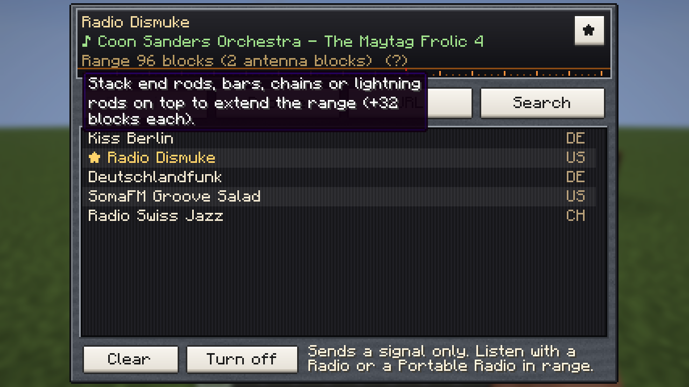

| Browse | URL | Search |
|---|---|---|
| 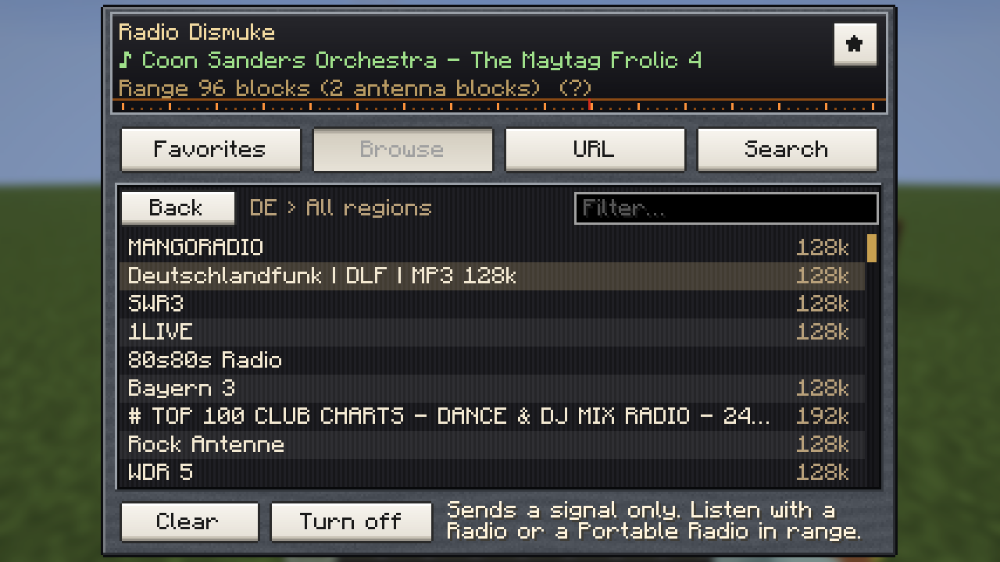 | 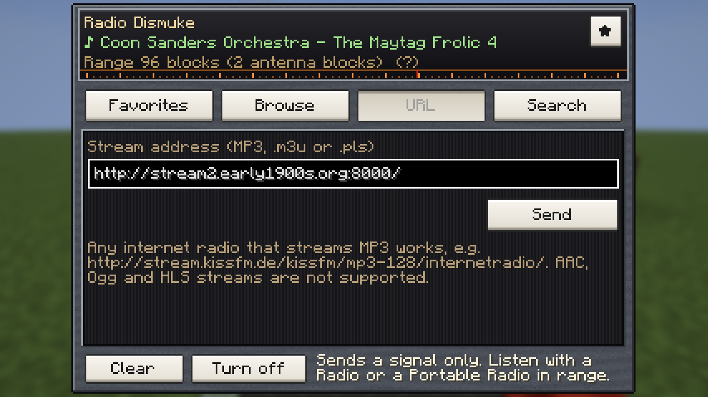 | 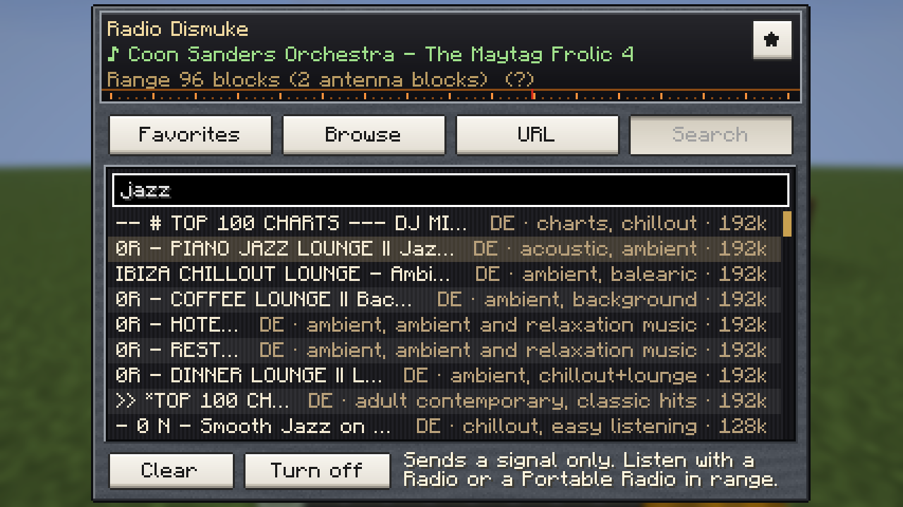 |

| Switched off | Amplifier | Creative tab |
|---|---|---|
| 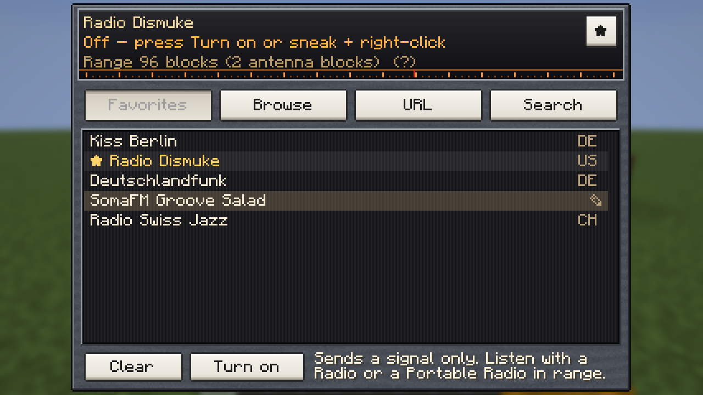 | 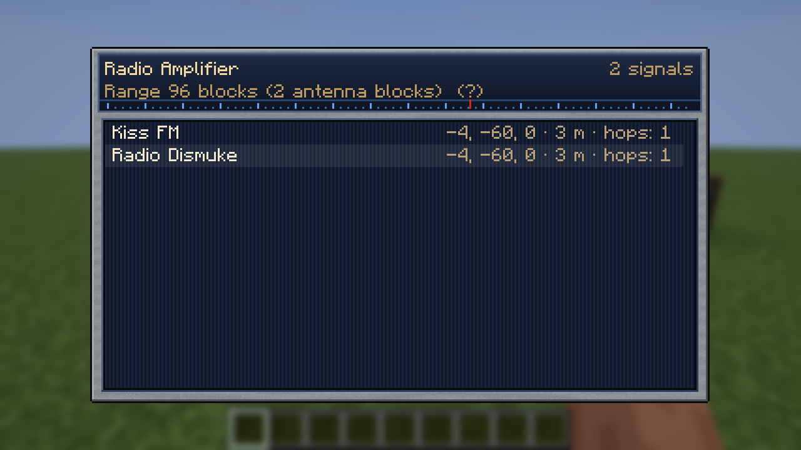 | 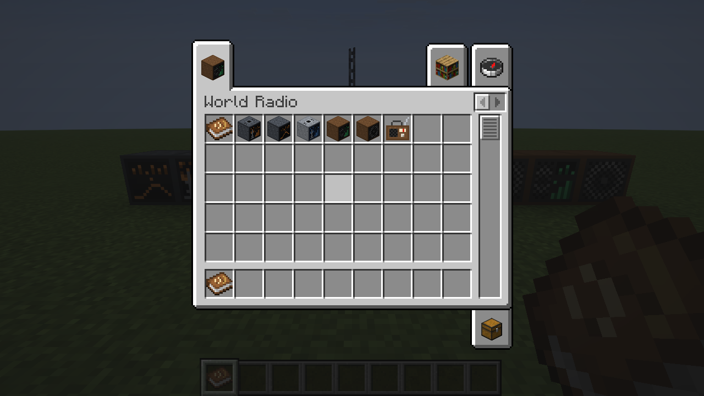 |

### Limits

- MP3 only: AAC, Ogg/Opus and HLS streams show "Cannot play this stream". About 70 % of the Radio-Browser
  catalogue is MP3.
- Stereo streams are mixed down to mono, so that the game can place the sound at the radio.
- Some stations only allow known player apps and refuse the connection (SomaFM, for example).
- A speaker makes its radio heard further; the sound still comes from the radio, not from the speaker.
- Version 2.0.0 split the Radio into transmitter and receivers. Radios from a 1.x world become Radio Transmitters
  (same block id `worldradio:radio`): station, antenna and on/off stay, their own volume is gone and they are silent
  until a Radio or Portable Radio picks them up. Amplifiers no longer make sound either.

## Crafting

The recipes are in the Redstone tab of the recipe book once you carry a copper ingot.

Radio Transmitter – a steel case with a mast:

```
I L I      I = iron ingot, L = lightning rod
C R C      C = copper ingot, R = block of redstone
I I I
```

Radio Channel – a transmitter without the mast:

```
I I I      I = iron ingot
C R C      C = copper ingot, R = redstone
I I I
```

Radio Amplifier – a transmitter that re-sends:

```
I C I      I = iron ingot, C = copper ingot
C W C      W = a radio transmitter
I R I      R = redstone
```

Radio – a wooden case with a speaker and a tuning circuit:

```
P I P      P = any planks, I = iron ingot
C N R      C = copper ingot (the coil), N = note block (the speaker), R = redstone (the tuner)
P P P
```

Speaker:

```
P W P      P = any planks, W = any wool
P N P      N = note block
P P P
```

Portable Radio:

```
  C        C = copper ingot (the antenna)
I N I      I = iron ingot, N = note block
  R        R = redstone
```

World Radio Guide (shapeless, in the Misc tab): a book and a copper ingot.

## Config

`config/worldradio.json`:

```json
{
  "configVersion": 5,
  "baseRange": 32,
  "antennaStep": 32,
  "maxAntenna": 32,
  "hearingBase": 4,
  "speakerStep": 4,
  "hearingMax": 64,
  "maxStations": 6
}
```

`baseRange`, `antennaStep` and `maxAntenna` (signal range) and `hearingBase`, `speakerStep` and `hearingMax` (how far
a Radio block is heard: without speakers, more per speaker, and at most) are read by the server. Older files are
carried over: the new entries are added, a
`ranges` list from 0.1/0.2 is dropped, and a 0.3 file (no `configVersion`) with the old default step of 8 is moved to
32. `maxStations` (at most 8, which is what the sound engine allows) is read by each player's game. The "+32 blocks each" and "+4 blocks each" in the tooltips
come from the player's own file.

## Commands (operators)

- `/worldradio tune <pos> "<url>" [name]` – set the station of a transmitter, a channel or a radio.
- `/worldradio enable <pos> true|false` – switch a transmitter, a channel or a radio on or off.
- `/worldradio volume <pos> <0-100>` – set a radio's volume.
- `/worldradio status <pos>` – range, antenna blocks and level of a transmitter or amplifier, what a transmitter or
  channel sends, which signals an amplifier or radio receives, a radio's hearing range and speakers, what it is set
  to and whether it plays.

## Building

Java 25, `./gradlew build` → `build/libs/worldradio-<version>.jar`. Needs Fabric API on client and server.

Test tools in `tools/`: `test-signal.sh` (signal graph, antenna range and level, volume and reception curves, what a
portable radio picks up, source choice – plain Java), `stream-probe.sh` (decodes live streams outside
Minecraft), `dev-test-network.sh` (RCON test against the dev server),
`dev-screenshot.sh` (dev client screenshots, clicks with an item in hand, using the held item, the on/off button,
list clicks, renaming, the volume slider, typing, hovering, walking and circling, and a per-second log of what the
player hears).

The art is generated, run from the project folder: `java tools/MakeTextures.java` (block and item textures, block
models), `java tools/MakeResources.java` (blockstates, item models, loot tables),
`java tools/MakeGuiTextures.java` (screen panels and keys), `java tools/MakeLogo.java <variant>` (the logo
`icon.png`, rendered from the block textures; previews in `art/logo/`).

## Credits

- MP3 decoding: [JLayer](https://github.com/umjammer/jlayer) 1.0.1 by JavaZOOM (LGPL 2.1), bundled unmodified.
- Station catalogue: [Radio-Browser](https://www.radio-browser.info) community database.

## Licence

MIT, see [LICENSE](LICENSE). By BaconCakeFactory.
